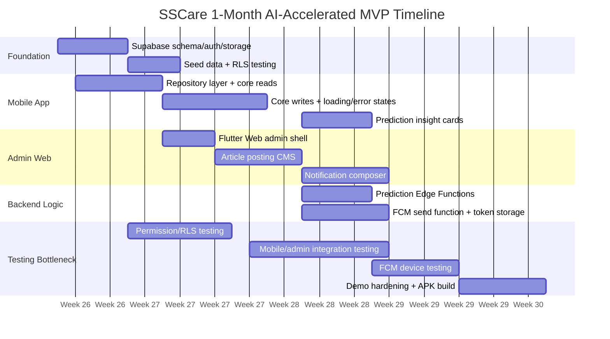

# Incoming Tasks Estimate - AI-Accelerated MVP

**Date:** 2026-06-21  
**Project:** SSCare  
**Estimate style:** AI-first implementation, testing/integration bottleneck.

## 1. Correction To Previous Estimate

The earlier estimate was too conservative because it assumed a traditional enterprise backend build. That is not how this project should be executed.

For this project, the bottleneck is **not writing code**. AI can generate most CRUD screens, database schema, repositories, admin pages, and rule functions quickly.

The real bottleneck is:

- testing real auth/data flows
- replacing `MockData` without breaking current app behavior
- validating database permissions and Row Level Security
- debugging mobile + web + backend integration
- testing push notifications on real Android devices
- checking prediction output against real saved data
- making sure admin actions appear correctly in mobile
- stabilizing build/deploy scripts

So this estimate treats implementation as fast and testing/integration as the main cost.

## 2. Current Baseline

The current Flutter app already has a strong prototype.

**Already exists:**
- Parent mobile UI for auth, dashboard, child profiles, check-in, measurements, cycle calendar, reports, library, article detail, article authoring prototype, reminders, notifications, and account management.
- Mock data for children, check-ins, measurements, menstrual periods, articles, reminders, and notifications.
- Client-side menstrual-cycle projection.
- Client-side height prediction.
- Android APK build process already proven through the `C:\sscare_run` ASCII build copy.

**Still missing:**
- Real backend persistence.
- Admin web app.
- Real article publishing pipeline.
- Real notification sending.
- Real prediction service layer.
- Real auth/roles.
- QA over connected data.

Current state means we are **not starting from zero UI**. We are connecting and productizing an existing prototype.

## 3. MVP Stack For 1 Month

Use the fastest stack that still supports real data and admin flows.

| Layer | Choice | Why |
|---|---|---|
| Database | Supabase Postgres | Relational data, fast setup, good for reporting |
| Auth | Supabase Auth | Avoid custom auth in month 1 |
| Storage | Supabase Storage | Article images and uploaded content assets |
| Backend logic | Supabase Edge Functions | Prediction rules, notification sending, scheduled jobs |
| Push | Firebase Cloud Messaging | Android notification delivery |
| Admin web | Flutter Web | Reuse Flutter skills and current UI patterns |
| Mobile integration | Supabase Flutter SDK | Faster than custom API clients |

No .NET, no Blazor, no Azure SQL for the 1-month MVP.

## 4. One-Month Build Target

At the end of 1 month, the goal is:

- Mobile app uses real Supabase data instead of `MockData` for core flows.
- Admin web can create/edit/publish articles.
- Admin web can compose/send basic notifications.
- Android push notification works through FCM.
- Mood prediction exists as a rule-based insight.
- Behavior prediction exists as a rule-based insight.
- Menstrual cycle prediction exists server-side using cycle records.
- Android APK can be built and used for demos/pilot testing.

This is **not** a finished production medical-grade system. It is a connected MVP.

## 5. Revised Task Estimate

The estimate is split into:

- **Code/scaffold:** what AI can mostly generate quickly.
- **Testing/integration:** the real bottleneck.
- **Realistic total:** elapsed working window, assuming tasks overlap where possible.

| Task | Code/Scaffold | Testing + Integration | Realistic Total |
|---|---:|---:|---:|
| Supabase database backend | 1-2 days | 3-5 days | 5-7 days |
| Web UI to post articles | 1-2 days | 2-4 days | 3-6 days |
| Web UI for notification system | 1-2 days | 4-6 days | 5-8 days |
| Mood prediction system | 0.5-1 day | 2-4 days | 3-5 days |
| Behavior prediction system | 1-2 days | 3-5 days | 4-7 days |
| Menstrual cycle prediction system | 0.5-1.5 days | 2-3 days | 3-4 days |
| Mobile replacement of `MockData` | 2-4 days | 5-8 days | 7-12 days |
| QA/demo stabilization | 1-2 days | 5-7 days | 6-9 days |

These should **not** be added as a strict waterfall. They overlap.

**Best-case connected MVP:** about 3 weeks.  
**Safer one-month MVP:** about 4 weeks.  
**One person:** possible, but tight and test-heavy.  
**Two people:** much safer.

## 5A. Visual Timeline - High-Level Review



### 4-Week Swimlane View

| Workstream | Week 1 | Week 2 | Week 3 | Week 4 |
|---|---|---|---|---|
| Backend / Supabase | Schema, auth, storage, RLS draft | Core write policies, storage rules | Edge functions for predictions + FCM | Fix data, permission, and deployment issues |
| Mobile app | Replace first `MockData` reads | Replace core writes | Prediction cards + notification sync | Regression pass + APK build |
| Admin web | Define admin routes/data model | Article CMS | Notification composer | Polish + demo workflow |
| Predictions | Define rules + table outputs | Menstrual prediction first | Mood + behavior rules | Validate outputs and safe wording |
| Testing focus | RLS + seed data | Admin publish -> mobile read | Push delivery + predictions | Full demo script, smoke tests, installable APK |

### Critical Path

```text
Supabase schema + RLS
  ↓
Mobile repository layer
  ↓
Core writes from mobile
  ↓
Admin article publish -> mobile library
  ↓
FCM token registration + notification send
  ↓
Prediction functions using real saved data
  ↓
End-to-end QA + APK build
```

### High-Level Review Takeaway

The month is not blocked by code generation. The month is blocked by proving this chain works repeatedly:

```text
admin/web action -> Supabase -> mobile app -> device behavior -> regression test
```

## 6. Real 1-Month Plan

## Week 1 - Supabase Foundation + First Mobile Data

**Primary goal:** real backend exists and the app can read real data.

**Build fast:**
- Supabase project.
- Tables:
  - profiles
  - child_profiles
  - daily_checkins
  - body_measurements
  - cycle_records
  - articles
  - article_bookmarks
  - article_ratings
  - reminders
  - notifications
  - notification_campaigns
  - device_tokens
- Basic Row Level Security policies.
- Seed data copied from current `MockData`.
- Flutter Supabase setup.
- Repository/service layer replacing direct mock reads for children, articles, and notifications first.

**Testing bottleneck:**
- RLS policies: parent can only see own child data.
- Admin can see/manage content.
- Seed data maps cleanly to current UI.
- App still renders when network calls fail.
- Android build still passes.

**End-of-week demo:** app reads children/articles/notifications from Supabase.

## Week 2 - Mobile Writes + Article Admin Web

**Primary goal:** parents can save data; admin can publish articles.

**Build fast:**
- Save/load child profiles.
- Save/load check-ins.
- Save/load measurements.
- Save/load cycle records.
- Save/load reminders.
- Flutter Web admin shell.
- Admin article list.
- Admin article create/edit form.
- Publish/archive toggle.
- Cover image upload to Supabase Storage.
- Mobile library shows published articles.

**Testing bottleneck:**
- Form validation.
- Published vs draft visibility.
- Image upload permissions.
- Mobile cache/state refresh after admin publish.
- Save/update/delete consistency.

**End-of-week demo:** admin publishes an article; mobile app displays it from Supabase.

## Week 3 - Notifications + Prediction Rules

**Primary goal:** notification system and prediction systems are connected.

**Build fast:**
- Firebase Android setup.
- Store FCM tokens in Supabase.
- Admin notification composer.
- Segment filters:
  - all users
  - child gender
  - child age range
  - notification category
- Edge Function for sending FCM notifications.
- Notification history table.
- Rule-based prediction functions:
  - mood trend from recent emotions
  - behavior/routine insight from check-in consistency, symptoms, practice/reminder completion
  - menstrual cycle next-window prediction from cycle records
- Mobile insight cards or report sections consuming prediction output.

**Testing bottleneck:**
- Real device token registration.
- Notification delivery on emulator and real Android phone.
- Notification center sync after send.
- Segment filters send to correct users only.
- Prediction output makes sense for sparse data.
- Safe wording: no medical diagnosis claims.

**End-of-week demo:** admin sends a notification; Android receives it; prediction cards show rule-based insights.

## Week 4 - Full Integration + Demo Hardening

**Primary goal:** the MVP is stable enough to show and test with real users.

**Build/fix:**
- Fill remaining mock-data gaps.
- Loading/error/empty states.
- Smoke tests for critical screens.
- Basic admin polish.
- APK build.
- Demo data.

**Testing bottleneck:**
- End-to-end flows:
  - parent login
  - create child
  - save check-in
  - save measurement
  - save cycle record
  - article publish to mobile
  - notification send to mobile
  - prediction output updates after data changes
- Device testing on Android.
- Regression testing existing screens.
- Permission testing for parent vs admin.

**End-of-week demo:** one APK + one admin web MVP + one Supabase project with real data.

## 7. What We Are Not Doing In Month 1

To keep this realistic, month 1 excludes:

- .NET backend.
- Blazor admin portal.
- Azure SQL.
- Entra ID B2C.
- OTP auth.
- Real ML training.
- iOS push/APNs.
- App Store / Play Store release.
- Full offline sync queue.
- Parent-to-parent sharing.
- Payment/subscription.
- Audit logs and enterprise approval workflow.
- Advanced analytics dashboard.
- Medical validation.

These are later-phase items.

## 8. The Real Bottleneck

The bottleneck is testing.

| Bottleneck | Why it costs time |
|---|---|
| Row Level Security | Easy to write, easy to get wrong, must test carefully |
| Push notifications | FCM requires real device/emulator testing and token lifecycle handling |
| MockData replacement | Current screens assume synchronous local data; real calls need loading/error states |
| Prediction rules | Code is easy; verifying outputs and wording is the work |
| Admin/mobile consistency | Publishing in web must show correctly in mobile |
| Permissions | Parent vs admin access must be tested, not just coded |
| Regression | Existing polished UI must not break while data source changes |

## 9. Feature Estimates Under This Model

## Web UI To Post Articles

**AI coding time:** 1-2 days.  
**Testing/integration time:** 2-4 days.  
**Total:** 3-6 days.

Use the existing article editor UI as a starting point, but move it to Flutter Web admin and connect it to Supabase. Most effort is testing publish/unpublish, image upload, and mobile library refresh.

## Mood Prediction System

**AI coding time:** 0.5-1 day.  
**Testing/integration time:** 2-4 days.  
**Total:** 3-5 days.

Rule-based only:
- low data
- stable
- increased tiredness
- increased worry
- mood volatility
- missing check-ins

No ML. No diagnostic language.

## Behavior Prediction System

**AI coding time:** 1-2 days.  
**Testing/integration time:** 3-5 days.  
**Total:** 4-7 days.

Rule-based insight system:
- missed check-in streak
- repeated symptoms
- low practice completion
- reminder overload
- inconsistent routine

The hard part is deciding safe wording and verifying it does not overclaim.

## Menstrual Cycle Prediction System

**AI coding time:** 0.5-1.5 days.  
**Testing/integration time:** 2-3 days.  
**Total:** 3-4 days.

This is the easiest prediction track because the data is structured. Use rolling average with irregularity detection and confidence. The app already has a strong client calendar; backend should become source of truth.

## Database Backend

**AI coding time:** 1-2 days for schema, RLS draft, seed data, and generated repository layer.  
**Testing/integration time:** 3-5 days.  
**Total:** 5-7 days.

The backend is not the long pole if we use Supabase and accept an MVP. The slow part is testing permissions and replacing `MockData` safely.

## Web UI For Notification System

**AI coding time:** 1-2 days.  
**Testing/integration time:** 4-6 days.  
**Total:** 5-8 days.

The UI is straightforward. FCM setup and end-to-end delivery testing are the bottleneck.

## 10. Minimum Team Plan

## If 1 Person

Possible, but tight. Cut scope if needed:
- Database + auth
- Article admin
- Menstrual prediction
- Basic notifications
- Defer mood/behavior polish until after demo

## If 2 People

Recommended.

**Person A:** Supabase schema, RLS, functions, FCM, prediction rules.  
**Person B:** Flutter mobile repository integration + Flutter Web admin.

## If 3 People

Comfortable.

**Person A:** Supabase/data/functions.  
**Person B:** Mobile app integration.  
**Person C:** Admin web + notification UI.

## 11. Acceptance Criteria For The 1-Month Build

The build is successful if:

- Parent data persists after app restart.
- Child profiles are stored in Supabase.
- Check-ins save and reload from Supabase.
- Cycle records save and prediction is backend-derived.
- Articles are created in admin web and appear in mobile library.
- Admin can send at least one push notification to Android.
- Notification center reads backend notifications.
- Mood and behavior insights are generated from real saved data.
- Android APK builds successfully.
- Critical flows pass smoke/regression tests.

## 12. Practical Recommendation

Do this as an AI-accelerated Supabase MVP.

Do **not** spend month 1 building a traditional backend. Do **not** try real ML. Do **not** overbuild admin permissions beyond what is needed for internal use.

The right mindset is:

> Generate fast, test hard, ship the connected MVP, then harden what survives user feedback.
